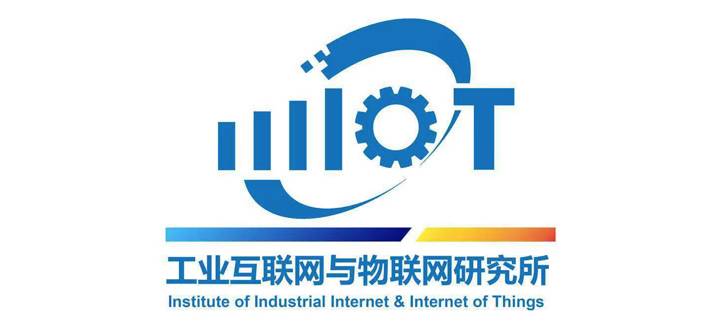

# VAA-DOCS
  
  
  
  此项目主要提供工业互联网标识相关技术文档。  
主要包括注册管理机构对接指南、用户统一认证平台对接指南、微服务应用说明、国家顶级节点对接指南、标识可信认证系统说明等技术资料。
## 1. 前端微服务使用说明
  对前端微服务框架的安装和配置进行说明，并介绍了如何基于此框架进行前端微应用的开发。文档资料详见[前端微服务使用说明](./micro-web/test.txt)。
